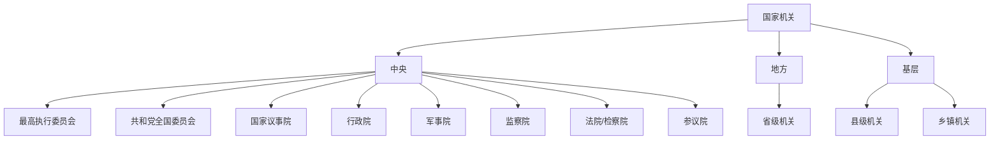

# 国家机关组成

## 组织结构
国家机关采用三级架构：中央、地方和基层，实行民主集中制原则。

## 权力分配
- **最高执行机关**：最高执行委员会
- **最高党务机关**：共和党全国委员会
- **最高权力机关**：（全国）议事院
- **最高行政机关**：行政院（中央政府）
- **最高军事机关**：军事院
- **最高监察机关**：监察院
- **最高司法机关**：（最高）法院，（最高）检察院
- **民主参政机关**：（全国）参议院
- **自治区最高权力机关**：自治区委员会

### 组织结构图
